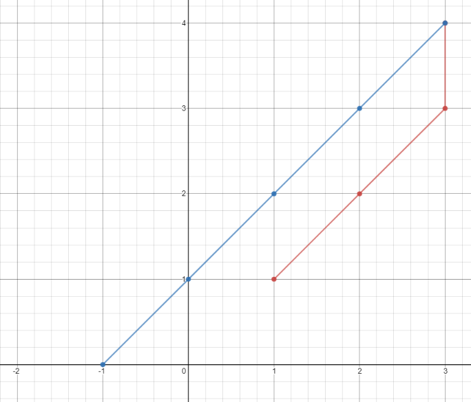

# Minimum Time Visiting All Points


## Problem 
On a 2D plane, there are `n` points with integer coordinates `points[i] = [xi, yi]`. **Return the minimum time** in seconds to visit all the points in the order given by `points`.

You can move according to these rules:

* In `1` second, you can either:
    * move vertically by one unit,
    * move horizontally by one unit, or
    * move diagonally `sqrt(2)` units (in other words, move one unit vertically then one unit horizontally in `1` second).
* You have to visit the points in the same order as they appear in the array.
* You are allowed to pass through points that appear later in the order, but these do not count as visits.

Example 1:

**Input :** points = [[1,1],[3,4],[-1,0]]
**Output :** 7
**Explanation :** 
    - One optimal path is [1,1] -> [2,2] -> [3,3] -> [3,4] -> [2,3] -> [1,2] -> [0,1] -> [-1,0]   
    - Time from [1,1] to [3,4] = 3 seconds 
    - Time from [3,4] to [-1,0] = 4 seconds
    - Total time = 7 seconds



Example 2:

**Input :** points = [[3,2],[-2,2]]
**Output :** 5


## Solution

This function calculates the minimum time required to visit all the points in a given array.

### Parameters

- `points` (Array): An array of points, where each point is represented as an array of two integers [x, y].

### Return Value

- `time` (Number): The minimum time required to visit all the points.

### Here's a step-by-step explanation of the code:

1. Initialize a variable `time` to 0, which will be used to accumulate the total time required to visit all points.

2. Use a for loop to iterate through each point in the `points` array.

3. Inside the loop, check if the current point is not the last point in the array `(i == points.length - 1)`. If it is the last point, break out of the loop because there is no need to calculate the distance from the last point to a non-existent next point.

4. Calculate the absolute differences between the x-coordinates and y-coordinates of the current point and the next point (i.e., `x_diff` and `y_diff`).

5. Increment the time variable by the maximum of `x_diff` and `y_diff`. This is because at each step, you can either move horizontally or vertically, and you want to choose the larger of the two differences to maximize the distance covered in each step.

6. After the loop, return the total accumulated `time` as the result.


### Let's take a example:

```
let points = [
[1, 1],
[3, 4],
[-1, 0],
];

console.log(minTimeToVisitAllPoints(points));
```

1. From point [1, 1] to [3, 4], the distance is (3-1) + (4-1) = 5.
2. From point [3, 4] to [-1, 0], the distance is |-1-3| + (0-4) = 8.

So, the total minimum time required to visit all points is 5 + 8 = 13. The code will output 13 when executed.


## Code 
``` JavaScript []
/**
 * @param {number[][]} points
 * @return {number}
 */
var minTimeToVisitAllPoints = function (points) {

    var time = 0;
    for (let i = 0; i < points.length; i++) {
        if (i == points.length - 1) break;
        let x_diff = Math.abs(points[i][0] - points[i + 1][0]);
        let y_diff = Math.abs(points[i][1] - points[i + 1][1]);
        time += x_diff > y_diff ? x_diff : y_diff;
    }
    return time;
};
```
``` Java []
class Solution {
    public int minTimeToVisitAllPoints(int[][] points) {
         int time = 0;
        for (int i = 0; i < points.length; i++) {
            if (i == points.length - 1) break;
            int x_diff = Math.abs(points[i][0] - points[i + 1][0]);
            int y_diff = Math.abs(points[i][1] - points[i + 1][1]);
            time += x_diff > y_diff ? x_diff : y_diff;
        }
        return time;
    }
}
```